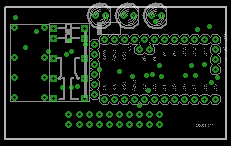
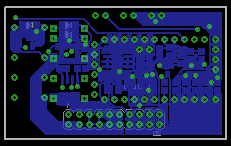

# Power backup automation for 12V battery.

## Features:
* Fits on DIN rail.
* Power source circuit cut-off when no power
   (saves battery energy when power is not available)
* Measures battery real capacity
* Measures input voltage
* Battery cut-off when discharged
* LED signalisation
* Open collector signal on battery or power fail
* Output 5V max.100mA
* Output from battery
* Arduino pro mini
* Output bistable relay (for energy saving)

## Box enclosure

## Main Board

## Main Board TOP layer

## Main Board BOTTOM layer

## Main Board schematic

